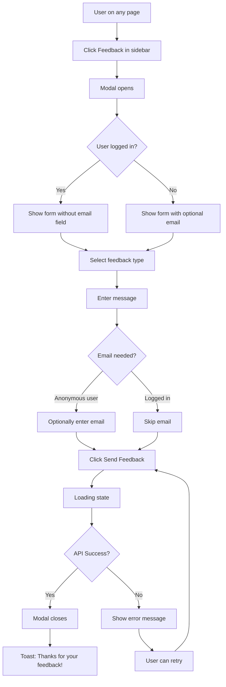

# User Feedback Collection User Journeys

## Primary Flow: Submit Feedback

**Trigger:** User clicks "Feedback" in sidebar
**Goal:** User successfully submits feedback and receives confirmation

### Flow Diagram

### Steps Detail

#### Step 1: Trigger Feedback Modal
- **Location:** Sidebar, "Support" section
- **Action:** Click "Feedback" button (MessageSquare icon + label)
- **Result:** Modal opens with fade animation

#### Step 2: Select Feedback Type
- **Options:** Bug (red), Feature Request (blue), Praise (green)
- **Default:** Bug selected (or none)
- **Interaction:** Click to select, visual indicator shows selection

#### Step 3: Enter Message
- **Field:** Textarea with placeholder "Tell us what's on your mind..."
- **Validation:** Required, min 1 character
- **Behavior:** Auto-focus on modal open

#### Step 4: Enter Email (Anonymous Only)
- **Visibility:** Only shown if user is not logged in
- **Label:** "Email (optional) - for follow-up"
- **Validation:** Valid email format if provided

#### Step 5: Submit
- **Button:** "Send Feedback" (disabled if message empty)
- **Loading:** Button shows spinner + "Sending..."
- **Prevention:** Double-submit prevented via disabled state

#### Step 6: Confirmation
- **Success:** Modal closes, toast appears bottom-right
- **Toast:** "Thanks for your feedback!" with description
- **Form Reset:** All fields cleared for next submission

### Implementation Sources

| Step | Design Source | Primary File | Key Feature |
|------|---------------|--------------|-------------|
| 1. Click trigger | [MagicPatterns](https://www.magicpatterns.com/c/ixx6mdxgjkjwkvsjuzybkg) | FeedbackTrigger.tsx | Sidebar button styling |
| 2. Select type | [MagicPatterns](https://www.magicpatterns.com/c/ixx6mdxgjkjwkvsjuzybkg) | FeedbackModal.tsx | Segmented control |
| 3. Enter message | [MagicPatterns](https://www.magicpatterns.com/c/ixx6mdxgjkjwkvsjuzybkg) | FeedbackModal.tsx | Textarea with validation |
| 4. Enter email | [MagicPatterns](https://www.magicpatterns.com/c/ixx6mdxgjkjwkvsjuzybkg) | FeedbackModal.tsx | Conditional input |
| 5. Submit | [MagicPatterns](https://www.magicpatterns.com/c/ixx6mdxgjkjwkvsjuzybkg) | FeedbackModal.tsx | Loading state button |
| 6. Confirmation | [MagicPatterns](https://www.magicpatterns.com/c/ixx6mdxgjkjwkvsjuzybkg) | FeedbackModal.tsx | Toast via sonner |

## Alternative Flows

### Cancel Submission
1. User opens modal
2. User clicks "Cancel" or clicks outside modal or presses Escape
3. Modal closes without submission
4. Form state is discarded

### Change Feedback Type Mid-Entry
1. User selects "Bug" and starts typing
2. User realizes it's actually a feature request
3. User clicks "Feature" - type changes, message preserved
4. User continues and submits

### Submit Multiple Feedbacks
1. User submits first feedback
2. Toast confirms, modal closes
3. User clicks Feedback again
4. Fresh form appears (all fields reset)
5. User submits second feedback

## Edge Cases

| Scenario | Behavior |
|----------|----------|
| Very long message | Textarea scrolls, no max length enforced (server validates) |
| Invalid email format | Validation error shown, submit blocked |
| Network timeout | Error toast, form preserved for retry |
| Session expires mid-submission | 401 error, redirect to login (handled by API layer) |
| Modal open, user navigates away | Modal closes, form state lost |
| Rapid double-click submit | Button disabled during loading prevents double submit |

## Error States

### Validation Errors
- **Empty message:** Submit button disabled (preventive)
- **Invalid email:** Inline error below field, red border

### API Errors
- **400 Bad Request:** Show field-level errors from API response
- **401 Unauthorized:** Redirect to sign-in (if session expired)
- **500 Server Error:** Toast: "Something went wrong. Please try again."
- **Network Error:** Toast: "Unable to connect. Check your connection."

### Error Recovery
- Form state preserved on error
- User can fix and retry without re-entering data
- Cancel always available to abandon

---

*Generated by designer-founder workflow on 2026-01-27*
