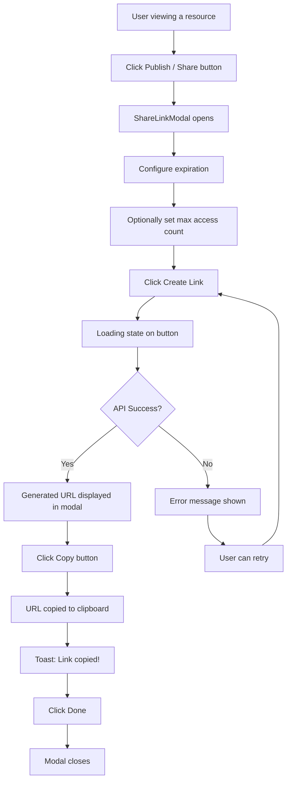
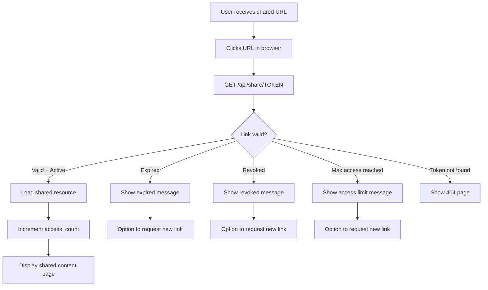
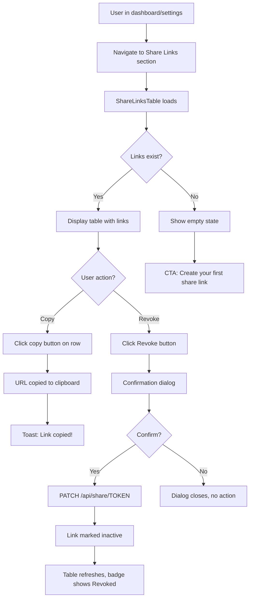

# Shareable Links User Journeys (Story 8.2)

## Journey 1: Create a Share Link

**Trigger:** User clicks "Publish" / "Share" on a resource
**Goal:** Generate a unique shareable URL and copy it

### Flow Diagram

### Steps Detail

#### Step 1: Open Share Modal
- **Location:** Resource page (e.g., report detail, document view)
- **Action:** Click "Publish" or "Share" button
- **Result:** `ShareLinkModal` opens as a dialog overlay

#### Step 2: Configure Options
- **Expiration:** Select from dropdown: Never, 1 day, 7 days, 30 days
- **Max access count:** Optional number input (leave empty = unlimited)
- **Default state:** Expiration = "Never", Max access = empty (unlimited)

#### Step 3: Create Link
- **Button:** "Create Link" (primary variant)
- **Loading:** Button shows loading state while API call in progress
- **Prevention:** Button disabled during loading to prevent double-submit

#### Step 4: Copy Generated Link
- **Display:** Generated URL shown in a read-only input with link icon
- **Action:** Click "Copy" button next to the URL
- **Feedback:** Icon swaps to checkmark, sonner toast "Link copied!"
- **Auto-select:** URL text is visually truncated but full URL is copied

#### Step 5: Close Modal
- **Button:** "Done" (replaces "Create Link" after generation)
- **Alternative:** Click X button or press Escape
- **Reset:** Form state resets when modal closes

### Implementation Sources

| Step | Design Source | Primary File | Key Feature |
|------|--------------|--------------|-------------|
| 1. Open modal | [MagicPatterns](https://www.magicpatterns.com/c/rcyosbx5s9dfvmc4jdmytw) | `ShareLinkModal.tsx` | Dialog trigger |
| 2. Configure | [MagicPatterns](https://www.magicpatterns.com/c/rcyosbx5s9dfvmc4jdmytw) | `ShareLinkModal.tsx` | Select + Input |
| 3. Create | [MagicPatterns](https://www.magicpatterns.com/c/rcyosbx5s9dfvmc4jdmytw) | `ShareLinkModal.tsx` | Button loading state |
| 4. Copy | [MagicPatterns](https://www.magicpatterns.com/c/rcyosbx5s9dfvmc4jdmytw) | `ShareLinkModal.tsx` | Clipboard API + toast |
| 5. Close | [MagicPatterns](https://www.magicpatterns.com/c/rcyosbx5s9dfvmc4jdmytw) | `ShareLinkModal.tsx` | Dialog close + reset |

---

## Journey 2: Access a Shared Link

**Trigger:** External user clicks a shared URL
**Goal:** View the shared content without authentication

### Flow Diagram

### Steps Detail

#### Step 1: Click Shared URL
- **Context:** User receives URL via email, chat, social media
- **URL format:** `https://app.example.com/share/[token]`
- **No auth required:** Public access, no login needed

#### Step 2: Validate Link
Server-side checks (in order):
1. Token exists in database
2. `is_active` is `true` (not revoked)
3. `expires_at` is null or in the future
4. `access_count < max_access_count` (if max set)

#### Step 3a: Valid Link → Show Content
- **Action:** Load the referenced resource (`resource_type` + `resource_id`)
- **Side effect:** Increment `access_count` in database
- **Display:** Read-only view of the shared content
- **No navigation:** Shared view is standalone (no app sidebar/nav)

#### Step 3b: Invalid Link → Show Error
- **Expired:** "This link has expired" message with timestamp
- **Revoked:** "This link is no longer available" message
- **Max reached:** "This link has reached its access limit" message
- **All cases:** Show "Request a new link" button/link (mailto or contact form)

---

## Journey 3: Manage Share Links

**Trigger:** User navigates to share links management
**Goal:** View, copy, and revoke existing share links

### Flow Diagram

### Steps Detail

#### Step 1: View Links Table
- **Location:** Dashboard settings or dedicated "Shared Links" page
- **Data:** Fetched via `GET /api/share` (authenticated, returns user's links only)
- **Columns:** Link URL (truncated), Status badge, Expiration, Access count, Actions

#### Step 2: Copy a Link
- **Action:** Click copy icon on any row
- **Feedback:** Icon swaps to checkmark briefly, sonner toast "Link copied!"
- **Clipboard:** Full URL copied regardless of truncation

#### Step 3: Revoke a Link
- **Action:** Click "Revoke" button on active link row
- **Confirmation:** Alert dialog: "Are you sure? This link will stop working immediately."
- **API call:** `PATCH /api/share/[token]` with `{ isActive: false }`
- **Result:** Badge changes to "Revoked" (destructive variant), Revoke button disappears
- **Toast:** "Link revoked successfully"

#### Step 4: Empty State
- **Display:** `EmptyState` component with link icon
- **Message:** "No share links yet"
- **CTA:** "Create a share link to get started"

### Table Columns

| Column | Content | Notes |
|--------|---------|-------|
| Link | Truncated URL + copy button | `{host}/share/{token}` |
| Status | Badge: Active (green), Expired (gray), Revoked (red) | Auto-determined from `is_active` + `expires_at` |
| Expires | Relative date or "Never" | `expires_at` formatted |
| Views | `{access_count}` / `{max_access_count}` or `{access_count}` (unlimited) | Access tracking |
| Actions | Revoke button (active only) | Disabled for already-revoked links |

### Implementation Sources

| Step | Design Source | Primary File | Key Feature |
|------|--------------|--------------|-------------|
| 1. View table | [MagicPatterns](https://www.magicpatterns.com/c/rcyosbx5s9dfvmc4jdmytw) | `ShareLinksTable.tsx` | Table layout + badges |
| 2. Copy link | [MagicPatterns](https://www.magicpatterns.com/c/rcyosbx5s9dfvmc4jdmytw) | `ShareLinksTable.tsx` | CopyButton component |
| 3. Revoke | Project pattern | `AlertDialog` (shadcn) | Confirmation + API call |
| 4. Empty state | [MagicPatterns](https://www.magicpatterns.com/c/rcyosbx5s9dfvmc4jdmytw) | `ShareLinksTable.tsx` | Empty state UI |

---

## Error Handling

| Scenario | User Experience |
|----------|----------------|
| Network error creating link | Toast error: "Failed to create link. Please try again." |
| Network error revoking link | Toast error: "Failed to revoke link. Please try again." |
| Clipboard API unavailable | Fallback: Select text in input for manual copy |
| API rate limit | Toast error: "Too many requests. Please wait a moment." |
| Expired link accessed | Friendly page with explanation + "Request new link" option |

---

*Generated by designer-founder workflow on 2026-02-02*
